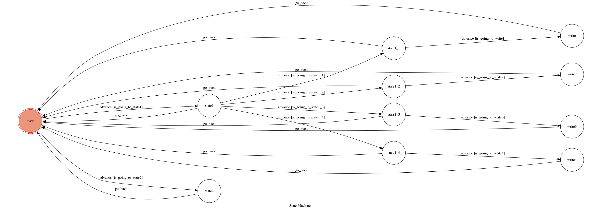

# 記帳貓咪


## Setup

### Prerequisite
* Python 3
* LineBOT

#### Install Dependency
```sh
pip3 install -r requirements.txt
```


#### Run the sever

```sh
python3 app.py
```

#### b. Servo

Or You can use [servo](http://serveo.net/) to expose local servers to the internet.


## Finite State Machine


## Usage
The initial state is set to `user`.


* user
	* Input: "記帳"
		* Reply: 喵喵喵~\n輸入想要記的項目~\n[餐費]  [娛樂]  [交通]  [其他]
			Input:"餐費"
				Reply:喵嗚嗚~\n輸入費用/或想刪除請輸入[清空]
					Input:"[正整數]
						Reply:好的已經記好了喵~\n想看完整的要輸入[我的帳本]\n我就會幫你打開了窩~
					Input:清空
						Reply:好的已經記好了喵~\n想看完整的要輸入[我的帳本]\n我就會幫你打開了窩~
			Input:"娛樂"
				Reply:喵嗚嗚~\n輸入費用/或想刪除請輸入[清空]
					Input:"[正整數]
						Reply:好的已經記好了喵~\n想看完整的要輸入[我的帳本]\n我就會幫你打開了窩~
					Input:清空
						Reply:好的已經記好了喵~\n想看完整的要輸入[我的帳本]\n我就會幫你打開了窩~
			Input:"交通"
				Reply:喵嗚嗚~\n輸入費用/或想刪除請輸入[清空]
					Input:"[正整數]
						Reply:好的已經記好了喵~\n想看完整的要輸入[我的帳本]\n我就會幫你打開了窩~
					Input:清空
						Reply:好的已經記好了喵~\n想看完整的要輸入[我的帳本]\n我就會幫你打開了窩~
			Input:"其他"
				Reply:喵嗚嗚~\n輸入費用/或想刪除請輸入[清空]
					Input:"[正整數]
						Reply:好的已經記好了喵~\n想看完整的要輸入[我的帳本]\n我就會幫你打開了窩~
					Input:清空
						Reply:好的已經記好了喵~\n想看完整的要輸入[我的帳本]\n我就會幫你打開了窩~
						
					

	* Input: "我的帳本"
		* Reply: 
		喵哈哈!!來看看你都花了多少錢吧~
		餐費:
		娛樂費:
		交通費:
		其他:
		總支出:

## Deploy
Setting to deploy webhooks on Heroku.


